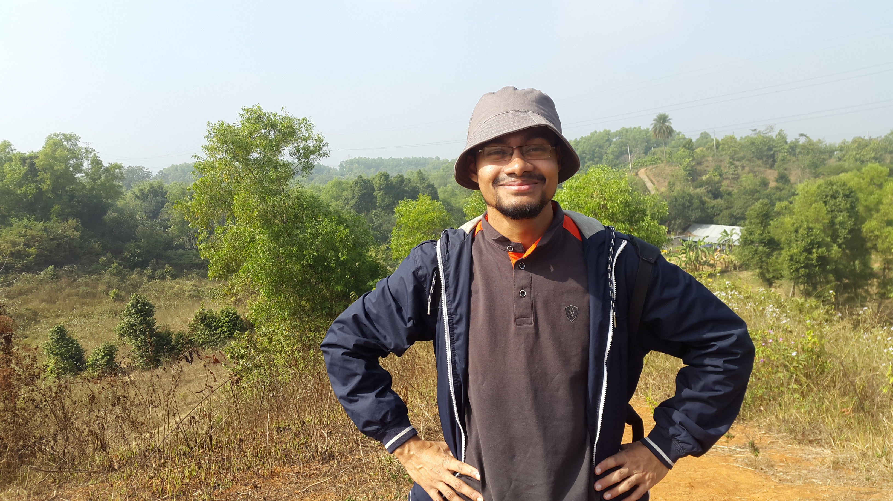

# Gallery {- #gallery}

```{r miu, echo=FALSE, fig.cap = "Lecture At MIU.", fig.align='center', out.width = '60%'}
knitr:: include_graphics(c("img/miu1.JPG"))
```

```{r sangla, echo=FALSE, fig.cap = "Sangla, Kinnaur, Hiamchal Pradesh, India", fig.align='center', out.width = '60%'}
knitr:: include_graphics("img/sangla.jpg")
```

```{r lal, echo=FALSE, fig.cap = "Roaming at Lalmai.", fig.align='center', out.width = '60%'}
knitr:: 
``` 

```{r cbil, echo=FALSE, fig.cap = "Roaming at Cholonbil.", fig.align='center', out.width = '60%'}
knitr:: include_graphics("img/cholonbil.jpg")
``` 


```{r mill, echo=FALSE, fig.cap = "Roaming in Pabna.", fig.align='center', out.width = '60%'}
knitr:: include_graphics("img/pabna_mill.jpg")
```

# Websites {-}

- [Statistics Lectures](https://lecture.statmania.info/): Academic Lectures
- [Stat Mania](https://www.statmania.info/): Web portal on statistics and mathematics
- [মহাবিশ্ব](https://sky.bishwo.com):Web portal on astronomy and cosmology

# Contact {-}

**Email:** almahmud.sbi[at]gmail.com

**Facebook:** [mahmud.sbi](https://www.facebook.com/mahmud.sbi)

**Linked In:** [mahmudstat](https://www.linkedin.com/in/mahmudstat/t)
